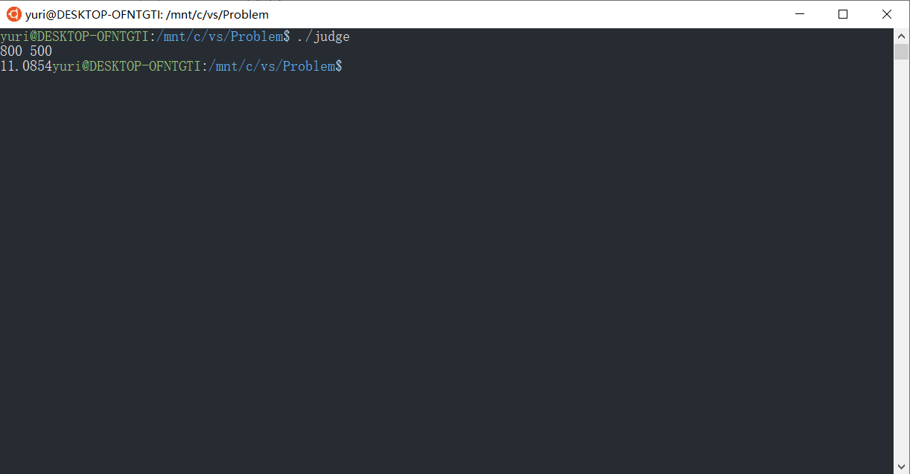

# Assignment 7
## Problem 2:Genetic Algorithm 
>Use genetic algorithm to find x* that satisfies
><center>x* = arg min<sub>x</sub> x·sin(x)</center>
>with the x $\in$ (-1,15)

In cpp file,I solve this problem using 5 functions and a class to store the data
+ 1.class of number
  + 1.stl template class'bitset' to store a number within 16 bits
  + 2.a function value() to change this code to a double number
+ 2.five functions
    + 1.main
    input the number of generations and the number of the data in the vector
    + 2.initial
    get a vector of numbers. I choose to use the rand() function in \<cstdlib>,and the time() function in \<ctime> to initialize the seed of the rand()
  + 3.mutation
    flip a certain bit of the code, the chance is 2<sup>-10</sup>
   + 4.binary
   exchange two bits of two number to generate two new number in the vector,which makes the number of numbers in vector doubles
   + 5.choose
  use a priority queue to choose the half of the number in the vector
  + and then return to the third funtion and run so on until the number of generation exceeds the given number

After the test, I find a better answer than the given one which is 11.054(less than 11.0857).
About 800 generations and a vector of 500 initial numbers can get a satisfying answer(It may differ because of the rand())

## Problem 3:Edit distance
+ we use a dynamic 2-dimension array dp[i][j] to record.
The number in dp[i][j] reprensents the least cost to get first j chars in target string from first i chars in original string
+ At first,I can initial all dp into -1,to show this unit undefined. And define the dp[0][0]=0,and then begin the recursion from dp[m][n]
+ In the process,we can get the different value from different operation, such as 
  <center>dp[i][j].value=dp[i][j-1].value+cost(insert)

  dp[i][j].value=dp[i-2][j-2].value+cost(twiddle)
  ......</center>
  then we choose the least one to be the value
+ there are some exceptions to notice
  + if i\==0&&j==0, cost(replace)=cost(copy)=∞
  + if j==0,cost(insert)=∞
  + if i==0,cost(delete)=∞
  + if j!=n,cost(kill)=∞
  + if x[i]!=y[j],cost(copy)=∞
  + if i<2 || j<2 ||x[i-1]!=y[j] ||x[i]!=y[j-1] cost(twiddle)=∞
+ in the process,we also record the operators, and use the cursive methods to print the all the operators, such as
  ```
  void print(int i,int j){
    switch(dp[i][j].op){
    case INSERT:print(i-1,j-1);cout<<"insert\t"break;
    case TWIDDLE:print(i-2,j-2);cout<<"twiddle\t"break;
    ...... 
    }
  }
  ```