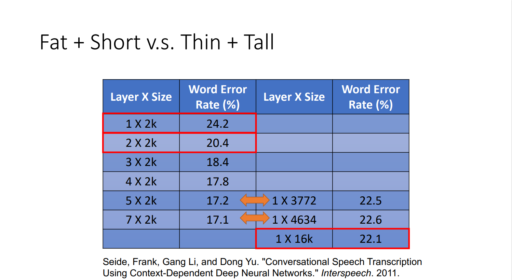
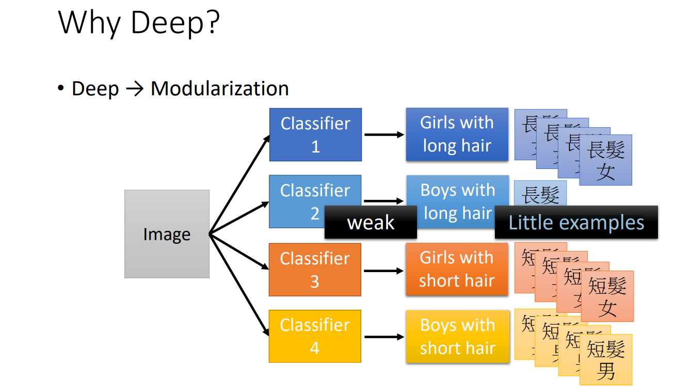
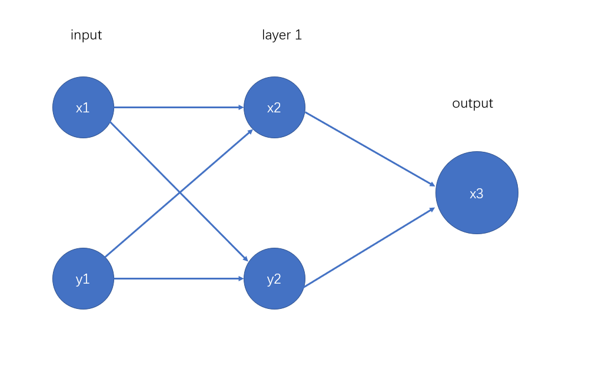

# homework8
## Problem 1
> Is deeper better in Deep Learning? Can you give some  examples/ researches/ experimental results to support or oppose to "deep"? 
+ Compared to "fatter","deeper" is regarded as a more effective way.From the class, we know in the experiment, "deeper" is better

+ Deeper is also helpful for Modularization

+ Nowadays, the neural network is far from reaching the upper limit of the number of layers.Theoretically,we can still improve the effect of the neural network by increasing the numbers of the layers.
+ In other way, "deeper" also means more time for learning and more space for storing the datas. So it's significant to determine a suitable number of layers for the neural network
>What parameters/designs/structures should be carefully concerned to obtain high performance in Deep Learning?
+ the number of layers
+ the number of units in each layer
+ the activation function
+ the cost function
+ the number of data for training and testing
## Problem 2
>Try to design a feedforward neural network to solve the XOR problem. The feedforward neural network is required to have two hidden neurons and one output neuron, and uses ReLU as the activation function

+ In the input layer and layer1,we use the ReLU function as activation function.
+ In the output layer,we use the function f with
  >$$ f(x)=\left\{
\begin{aligned}
1   &&   x>0.5\\ 
0   && x<0.5\\
\end{aligned}
\right.
$$

## Problem 3
>Dropout is a regularization method that approximates training a large number of neural networks with different architectures in parallel. During training, some neurons are randomly dropped out. In Figure 1, the neurons that marked with a red cross will be dropped out during training. For simplication, the bias of neuron is 0 and omitted in Figure 1. Assume dropout rate is 0.25. This network uses ReLU as the activation function.

|units |training|testing|
| :-----:| :----: | :----: |
|1|0|4|
|2|4|4|
|3|dropout|0|
|4|1|1|
|y1|4|4|
|y2|0|2|
